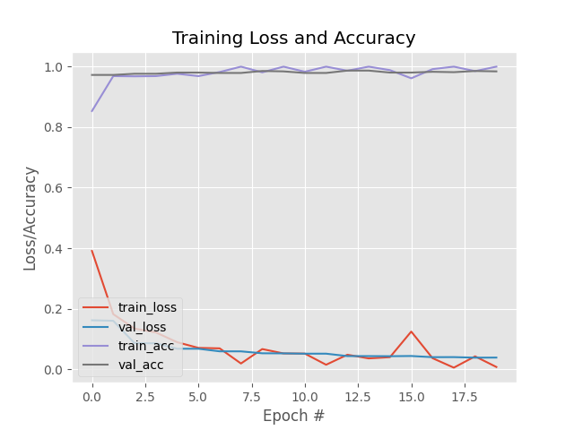

# 🎭 Face Mask Detection System

Real-time face mask detection using Deep Learning (MobileNetV2) and OpenCV.


## 🎯 Overview

Detects whether people are wearing face masks in:
- 📸 Static images
- 🎥 Real-time video (webcam)

**Accuracy: 98%** on test dataset of 1900 images.


## ✨ Features

- ✅ Real-time webcam detection
- ✅ Image detection
- ✅ 98% accuracy
- ✅ Lightweight model (11MB)
- ✅ MobileNetV2 architecture


## 🚀 Installation

1. Clone repository
```bash
git clone https://github.com/SaurabhD19/facemask-detection.git
cd facemask-detection
```

2. Create virtual environment
```bash
python -m venv .venv
source .venv/bin/activate
```

3. Install dependencies
```bash
pip install -r requirements.txt
```

4. Download face detector models
```bash
mkdir -p facedetector face_detector
curl -o facedetector/deploy.prototxt https://raw.githubusercontent.com/opencv/opencv/master/samples/dnn/face_detector/deploy.prototxt
curl -o facedetector/res10_300x300_ssd_iter_140000.caffemodel https://raw.githubusercontent.com/opencv/opencv_3rdparty/dnn_samples_face_detector_20170830/res10_300x300_ssd_iter_140000.caffemodel
ln -s facedetector face_detector
```

5. Download trained model from [Releases](https://github.com/SaurabhD19/FaceMask-Detection/releases/download/v1.0/maskdetector.keras)


## 📁 Project Structure
```
FaceMask-Detection/
├── dataset/                    # Training data (not included)
│   ├── with_mask/
│   └── without_mask/
├── facedetector/              # Face detection models
│   ├── deploy.prototxt
│   └── res10_300x300_ssd_iter_140000.caffemodel
├── examples/                  # Demo images
├── train_mask_detector.py    # Training script
├── Detectimage.py            # Image detection
├── Detectvideo.py            # Video detection
├── maskdetector.keras        # Trained model (download separately)
├── plot.png                  # Training metrics
├── requirements.txt          # Dependencies
├── .gitignore               # Git ignore rules
└── README.md                # Documentation
```


## 📖 Usage

### Detect in Image
```bash
python Detectimage.py --image path/to/image.jpg
```

### Real-time Webcam
```bash
python Detectvideo.py
```
Press `q` to quit.

### Train Model
```bash
python train_mask_detector.py -d dataset
```


## 📊 Dataset

- Total: 3,827 images
- With Mask: 1,915
- Without Mask: 1,912


## 📈 Results
### Model Performance

| Metric | With Mask | Without Mask | Overall |
|--------|-----------|--------------|---------|
| Precision | 0.98 | 0.99 | 0.98 |
| Recall | 0.99 | 0.98 | 0.98 |
| F1-Score | 0.98 | 0.98 | 0.98 |

**Key Metrics:**
- ✅ Training Accuracy: 100%
- ✅ Validation Accuracy: 98.4%
- ✅ Test Accuracy: 98%
- ✅ Test Loss: 0.036

### Training Visualization


*Loss and accuracy curves over 20 epochs*


## 🛠️ Technologies
- Python 3.12
- TensorFlow/Keras
- OpenCV
- MobileNetV2
- NumPy


## 🏗️ Model Architecture
```
Input Image (224x224x3)
        ↓
MobileNetV2 (Pretrained on ImageNet)
        ↓
Average Pooling (7x7)
        ↓
Flatten
        ↓
Dense (128, ReLU)
        ↓
Dropout (0.5)
        ↓
Dense (2, Softmax)
        ↓
Output: [With Mask, Without Mask]
```

**Training Configuration:**
- Optimizer: Adam (lr=1e-4)
- Loss: Binary Crossentropy
- Batch Size: 32
- Epochs: 20
- Data Augmentation: Yes


## 👤 Author
**Saurabh Dubey**

- GitHub: [@SaurabhD19](https://github.com/SaurabhD19)

⭐ Star this repo if you found it helpful!

